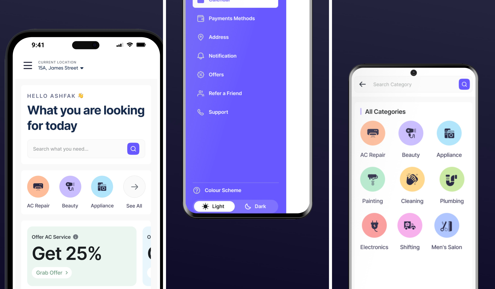

# Teste Prático (Vaga Mobile PL 1) – Guató Digital

Projeto React Native, desenvolvido com framework Expo, para teste prático para vaga de mobile de PL Guató Digital.



## Pré-requisitos

Antes de começar, você precisa ter instalado em sua máquina:

- Node.js (versão 18.x)
- Ambiente de desenvolvimento [React Native](https://react-native.rocketseat.dev/)

## Instalação

Siga os passos abaixo para instalar e configurar o projeto em sua máquina local.

1. **Clone o repositório**
   ```bash
   git clone https://github.com/mayromyller/teste-pl-react-native.git
   ```
2. **Navegue até o diretório do projeto**
   ```bash
   cd teste-pl-react-native
   ```
3. **Instale as dependências**
   ```bash
   npm install
   ```
   ou, caso utilize `yarn`:
   ```bash
   yarn install
   ```

## Executando o Projeto

Para iniciar o servidor local, execute o seguinte comando:

```bash
yarn start
```

Utilizando aplicativo [Expo Go](https://play.google.com/store/apps/details?id=host.exp.exponent&hl=pt_BR), escaneie o QRCode para executar o projeto.

## Uso

Demonstração de uso do aplicativo:

https://github.com/user-attachments/assets/8ec12c64-c8fb-4f28-9e0d-c3169f4ba1e7

## Tecnologias

Dentre as tecnologias utilizadas, destaco:

- Typescript
- Styled Components
- React Native
- Expo
- React Navigation
- Axios

## Detalhes

A aplicação está integrada com a API pública do Random User Generator, disponível em [https://randomuser.me/](https://randomuser.me/). As chamadas são feitas utilizando a biblioteca [Axios](https://github.com/axios/axios). Ao abrir a aplicação ela carregar detalhes de endereço do usuário como endereço. Ao abrir o menu lateral (Drawer), é possível ver a imagem que é carregada também via API. Ao clicar na imagem é possível acessar os detalhes do perfil do usuário.

Na tela de perfil é possível ver os dados do usuário, como nome, data de nascimento, endereço, telefone e email. Como a API do Random User carrega sempre dados aleatórios, é possível ver diferentes perfis com diferentes dados ao navegar pelo aplicativo.

## Contato

- [Linkedin - Mayro Myller](https://www.linkedin.com/in/mayromyller/)
- Email: mayromyller@gmail.com
